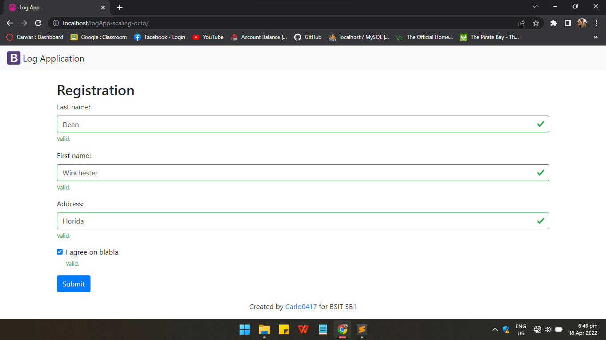
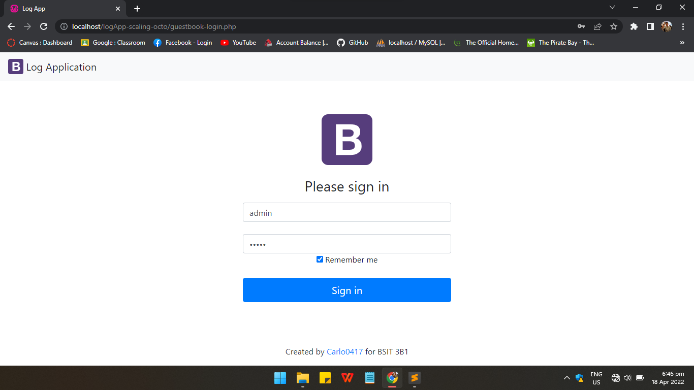
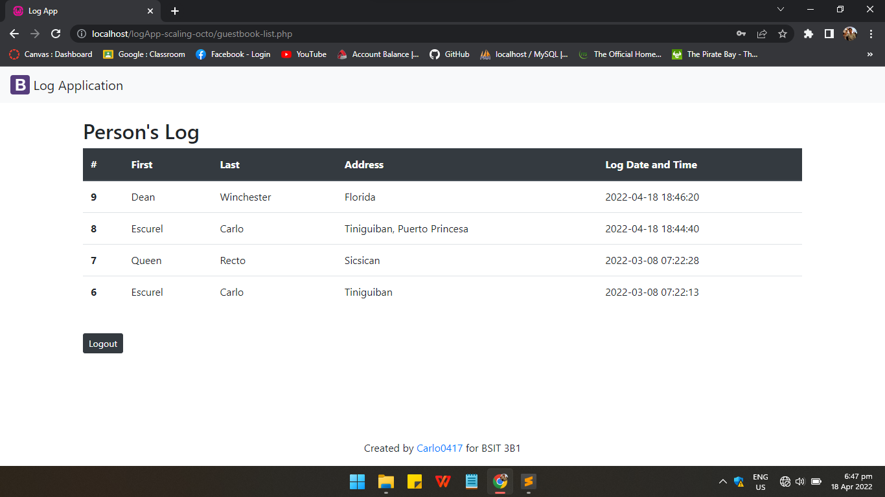

##### :space_invader: This repo is from Practice Set 5-06

# logApp-scaling-octo

logApp-scalling-octo or **logApp** is a sample application that logs the individual's personal information and the date and time he/she visits the place via its **Registration Page**. It also has a **Login Page** for the administrator to enter the **Main Page** and view the information acquired from the registration through table, as well as a **Logout** button to exit the Main Page.

 

## Visuals

### **Registration without content**

 

### **Registration with content**

 

### **Admin Login Page**

 

### **Admin Login Page with content**

 

### **Table of Data from Registration**

 

## Database Preparation
* Install *WampServer* and access *phpMyAdmin*.
* Change your *Username* and *Password*.
* Import *logapp.sql* provided on this repo in phpMyAdmin.
* Modify the *config.php* and *db.php* in folder **config** by your username and password in phpMyAdmin.
* Feel free to edit the person and account table and its data.

 

## Authors

 

## &nbsp; &nbsp; &nbsp; &nbsp; &nbsp; &nbsp; &nbsp; &nbsp; &nbsp; &nbsp; &nbsp; &nbsp; &nbsp; &nbsp; &nbsp; &nbsp; **Carlo Escurel**

   

## &nbsp; &nbsp; &nbsp; &nbsp; &nbsp; &nbsp; &nbsp; &nbsp; &nbsp; &nbsp; &nbsp; &nbsp; &nbsp; &nbsp; &nbsp; &nbsp; **Queenie Recto**

